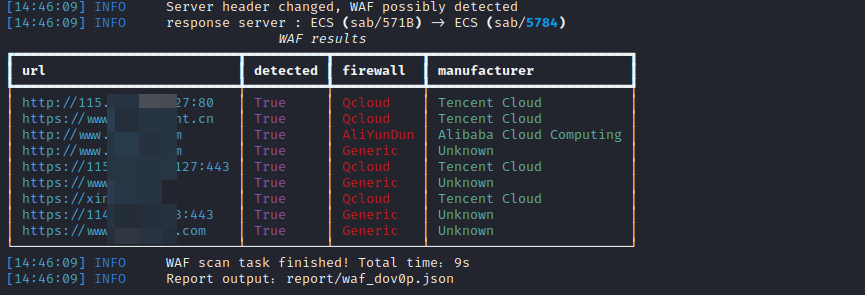

# 1. waf-scan

> 前言：基于wafw00f的插件内容，实现多线程批量识别版本。

## 1.1. Usage

```yaml
# 对单个目标进行扫描 #
python waf-scan.py -t https://example.com

# 对多个目标进行扫描 #
python waf-scan.py -f targets.txt

# 结果输出 #
`/report/`目录下会生成对应目标的json结果文件。
```

## 1.2. 程序兼容性

python版本 >=  3.8.0

## 1.3. Update

| 更新时间（版本）          | 更新内容 | 备注         |
|-------------------|------| ------------ |
| 2023.8.15(v0.0.1) | 内测版本 | 有问题联系我 |
